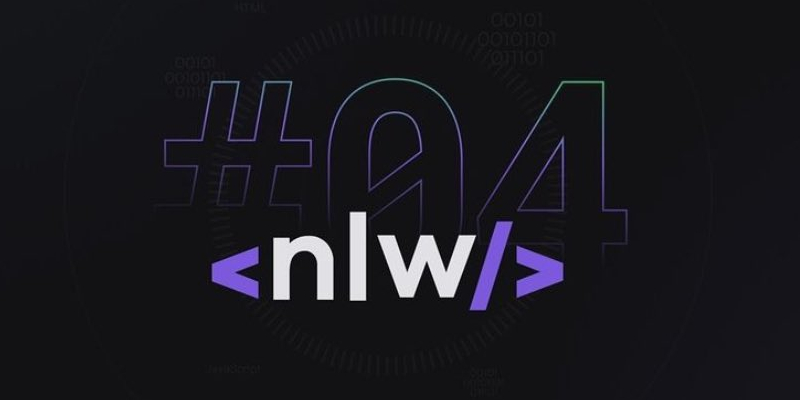

<h3 align="center">
  
</h3>

  <a href="#-tech">Technologies</a>&nbsp;&nbsp;&nbsp;|&nbsp;&nbsp;&nbsp;
  <a href="#-about">About</a>&nbsp;&nbsp;&nbsp;&nbsp;&nbsp;&nbsp;

    <em>This course was taught by <a href="https://github.com/danileao">Daniele Leão</a> during <strong>Next Level Week #04</strong>, by <a href="https://github.com/rocketseat-education/">Rocketseat</a>.</em>

## :open_file_folder: About the Project

This is a web application for Net Promoter Score (NPS), back-end and Restful API, built on the Next Level Week, annually promoted event by Rocketseat.

## :hammer_and_wrench: Technologies

A complete application built using the following languages/technologies/frameworks:

-   TypeScript
-   Node.js
-   Express
-   YARN
-   Insomnia
-   TypeORM
-   SQLite
-   BeeKeeper Studio
-   Jest
-   Nodemailer
-   Handlebars

## :rocket: NLW Node.js Learning Pathway

### Lesson#1 - Towards Next Level

-   [x] Creating a Node.js project:
    -   [x] Learning HTTP mostly used verbs and methods;
    -   [x] Implementing GET and POST routes;
    -   [x] Setting up Insomnia to test the routes;

### Lesson#2 - Databases

-   [x] Learn about approaches on manipulating databases with node
-   [x] Install and configure TypeORM on the application
-   [x] Create user migration
-   [x] Create user model
-   [x] Create user controller
    -   [x] Implement a business rule: must not be possible to create users with same email;
-   [x] Create a user route

### Lesson#3 - Testing the app

#### SOW - Statement of Work

-   [x] Refactoring the controller
    -   [x] Create a user's repository
    -   [x] Change in responsabilities: from controller to created user's repository
-   [x] Implement a migration for the survey's queries
-   [x] Implement a controller for surveys
-   [x] What are automated tests?
-   [x] How to implement integration tests

### Lesson#4 - Mail sending

#### SOW - Statement of Work

-   [x] Implement surveys_users table and create method via POST

    -   [x] Create a SurveysUser migration
    -   [x] Create a SurveyUser model
    -   [x] Create a SurveysUserRepository
    -   [x] Create a SendMailController
    -   [x] Create a sendMail route

-   [x] Implement a mail service
    -   [x] Install nodemailer
    -   [x] Create a SendMailService
    -   [x] Update at SendMailController
-   [x] Send a functional mail through the application
-   [x] Emebed a html styled template with Handlebars

### Lesson#5 - Validations and finishing the NPS API

#### SOW - Statement of Work

-   [x] Refactor the SendMailController
-   [x] Create controller of users answers
-   [x] Validate that user exists
-   [x] Validate if the survey was already answered
-   [x] Process the user's answered rate
-   [ ] Create controller that calculate NPS
-   [ ] Implement validations
